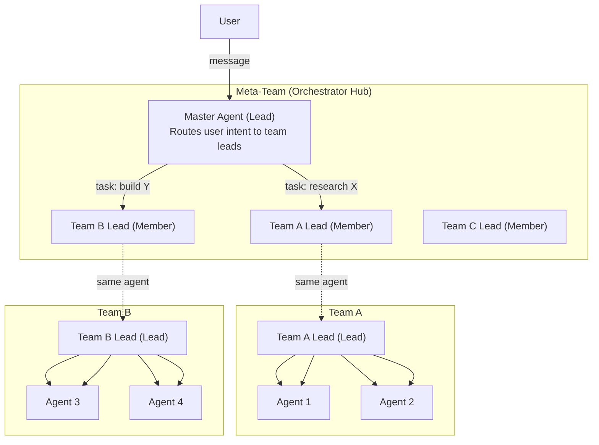

# Meta-Team Orchestrator — Design & Implementation Plan

## 1. Problem

GoClaw's team system is **intra-team only**: a lead orchestrates members within a single team. There is no mechanism for a "super-lead" to coordinate work **across multiple teams**, route user requests to the appropriate team, or aggregate results from different teams.

## 2. Solution: Meta-Team Pattern

A **master orchestrator agent** sits atop all teams as the lead of a special "Meta-Team". Each existing team's lead agent is added as a **member** of this meta-team. The master routes incoming user requests to the right team lead via the shared task board.



### Why This Works (Key Architecture Facts)

| Concern | Resolution |
|---------|-----------|
| **TEAM.md priority** | `GetTeamForAgent` uses `ORDER BY (lead_agent_id = $1) DESC` — teams where the agent is **lead** are always prioritized. Team leads see their own team's TEAM.md, never the meta-team's. |
| **Single-leadership constraint** | Each agent can lead only ONE team. Team leads join meta-team as **members**, not leads. No conflict. |
| **Agents in multiple teams** | Fully supported. Comments in `context_keys.go:301` and `team_tool_cache.go:26` confirm multi-team membership. Tool context uses `WithToolTeamID` for correct resolution. |
| **Cross-team task isolation** | Tasks are scoped per-team. Meta-team tasks and Team A tasks are on separate boards. No cross-contamination. |
| **Lead dispatch block** | `dispatchTaskToAgent` blocks dispatch to lead agents (prevents dual-session loop). Task cascading creates NEW tasks in the lead's team instead of dispatching directly. |

### Master Agent Persona

- **Neutral orchestrator** — no domain expertise
- Reads incoming request, identifies which team lead is best suited
- Creates tasks on the meta-team board assigned to the right lead(s)
- Supports parallel routing (e.g., "research X" → Team A, "design Y" → Team B simultaneously)
- Synthesizes results from leads into a final response

---

## 3. Implementation

### Phase 1: Seeding Script

**File:** `scripts/seed-meta-team.js`

1. Connect via WebSocket, authenticate with system token
2. Create `master-orchestrator` agent:
   - Agent type: `open`
   - Persona: neutral orchestrator focused on routing and synthesis
   - Model: strong model (Claude/GPT-4/Gemini)
3. Call `teams.list` → collect all team lead agent keys
4. Call `teams.create`:
   - Name: `Meta-Team`
   - Lead: `master-orchestrator`
   - Members: all discovered team lead agent keys
5. Log results

**Auto-Discovery:** The script dynamically discovers ALL existing teams and their leads — no hardcoding.

### Phase 2: Auto-Add on Team Creation

**Goal:** When a new team is created, automatically add its lead to the meta-team.

**Mechanism:** Subscribe to the `team.created` bus event (already broadcast by `teams.go:198-208`).

**File changes:**

#### `cmd/gateway.go`

Add a bus subscriber after existing team-related subscribers:

```go
// Auto-add new team leads to meta-team for orchestration.
msgBus.Subscribe("meta-team.auto-add", func(evt bus.Event) {
    payload, ok := evt.Payload.(protocol.TeamCreatedPayload)
    if !ok {
        return
    }

    // Find meta-team by well-known name
    metaTeam := findMetaTeam(ctx, teamStore)
    if metaTeam == nil {
        return // No meta-team configured, skip
    }

    // Don't self-reference: skip if the created team IS the meta-team
    if payload.TeamID == metaTeam.ID.String() {
        return
    }

    // Resolve lead agent
    leadAgent, err := agentStore.GetByKey(ctx, payload.LeadAgentKey)
    if err != nil {
        slog.Warn("meta-team.auto-add: cannot resolve lead", "key", payload.LeadAgentKey, "err", err)
        return
    }

    // Add lead as member of meta-team
    if err := teamStore.AddMember(ctx, metaTeam.ID, leadAgent.ID, "member"); err != nil {
        slog.Warn("meta-team.auto-add: failed to add member", "key", payload.LeadAgentKey, "err", err)
        return
    }

    // Create delegation link: meta-lead → new lead
    if linkStore != nil {
        _ = linkStore.CreateLink(ctx, &store.AgentLinkData{
            SourceAgentID: metaTeam.LeadAgentID,
            TargetAgentID: leadAgent.ID,
            Direction:     "outbound",
            TeamID:        &metaTeam.ID,
            Description:   "auto-created by meta-team",
            MaxConcurrent: 3,
            Status:        "active",
            CreatedBy:     "system",
        })
    }

    // Invalidate caches
    teamsMethods.invalidateTeamCaches(ctx, metaTeam.ID)
    slog.Info("meta-team.auto-add: added team lead", "key", payload.LeadAgentKey, "team", payload.TeamName)
})
```

**Helper function:**

```go
func findMetaTeam(ctx context.Context, ts store.TeamStore) *store.TeamData {
    teams, err := ts.ListTeams(store.WithCrossTenant(ctx))
    if err != nil {
        return nil
    }
    for _, t := range teams {
        if t.Name == "Meta-Team" && t.Status == "active" {
            return &t
        }
    }
    return nil
}
```

### Phase 3: Task Cascading (Multi-Team Fan-Out)

**Goal:** A single meta-task can spawn **N sub-tasks across M teams**. The meta-task only completes when **ALL sub-tasks from ALL teams** are done.

**Constraint:** `dispatchTaskToAgent` blocks dispatch to lead agents (prevents dual-session loop). Cascading must create NEW tasks in the lead's team rather than dispatching directly.

#### Data Model: `meta_task_links`

```sql
CREATE TABLE meta_task_links (
    id           UUID PRIMARY KEY DEFAULT gen_random_uuid(),
    meta_task_id UUID NOT NULL REFERENCES team_tasks(id) ON DELETE CASCADE,
    sub_task_id  UUID NOT NULL REFERENCES team_tasks(id) ON DELETE CASCADE,
    sub_team_id  UUID NOT NULL,
    status       TEXT NOT NULL DEFAULT 'pending',
    created_at   TIMESTAMPTZ NOT NULL DEFAULT now(),
    UNIQUE(meta_task_id, sub_task_id)
);
CREATE INDEX idx_meta_task_links_meta ON meta_task_links(meta_task_id);
CREATE INDEX idx_meta_task_links_sub  ON meta_task_links(sub_task_id);
```

#### Cascade Flow

```
Meta-Task: "Build and launch feature X"   (Meta-Team)
  │
  ├─ Sub-task 1: "Implement UI" → Team A
  │     └─ Team A lead delegates to members
  │     └─ ✅ Completed → link status = completed
  │
  ├─ Sub-task 2: "QA & deploy" → Team B
  │     └─ ✅ Completed → link status = completed
  │
  └─ Sub-task 3: "GTM campaign" → Team C
        └─ ✅ Completed → ALL links done → META-TASK AUTO-COMPLETES ✅
```

#### Bus Subscribers

**Subscriber A — Cascade on assignment** (`protocol.EventTeamTaskAssigned`):
1. Is task in meta-team? → continue
2. Resolve assigned agent → find their team via `GetTeamForAgent`
3. Create sub-task in that team (unassigned, pending — lead picks up naturally)
4. Insert `meta_task_links` row

**Subscriber B — Aggregate completion** (`protocol.EventTeamTaskCompleted`):
1. Lookup `meta_task_links` by `sub_task_id`
2. Update link status to `completed`
3. `AreAllSubTasksComplete(meta_task_id)` → if yes:
   - Aggregate results from all sub-tasks
   - Auto-complete meta-task with combined result
   - Broadcast completion event

**Subscriber C — Propagate failure** (`protocol.EventTeamTaskFailed`):
1. Update link status to `failed`
2. Optionally fail whole meta-task or mark individual link only

### Configuration

| Setting | Value | Notes |
|---------|-------|-------|
| Meta-team name | `"Meta-Team"` | Well-known constant used for lookup |
| Master agent key | `"master-orchestrator"` | Set in seeding script |
| Subscriber topic | `"meta-team.auto-add"` | Standard bus subscriber pattern |

---

## 4. Verification Plan

| Step | Action | Expected |
|------|--------|----------|
| 1 | Run `seed-meta-team.js` | Master agent + Meta-Team appear in dashboard |
| 2 | Check meta-team members | All existing team leads listed as members |
| 3 | Create a new team via dashboard | New lead auto-added to meta-team |
| 4 | Message the master agent | Master creates task → assigned to correct lead |
| 5 | Check task completion flow | Lead delegates to own team → result returns to master → user sees result |
| 6 | Meta-task assigned to 2+ leads | Sub-tasks appear in each lead's team |
| 7 | Complete all sub-tasks | Meta-task auto-completes with aggregated result |
| 8 | Complete only some sub-tasks | Meta-task stays in-progress |
| 9 | Fail one sub-task | Meta-task reflects the failure |

---

## 5. File Reference

| File | Change |
|------|--------|
| `scripts/seed-meta-team.js` | **[NEW]** Seeding script |
| `cmd/gateway.go` | **[MODIFY]** Add auto-add + 3 cascading bus subscribers |
| `internal/store/pg/meta_task_links.go` | **[NEW]** Store methods for link CRUD |
| DB migration | **[NEW]** `meta_task_links` table |
| `docs/meta-team-orchestrator-plan.md` | **[NEW]** This document |
