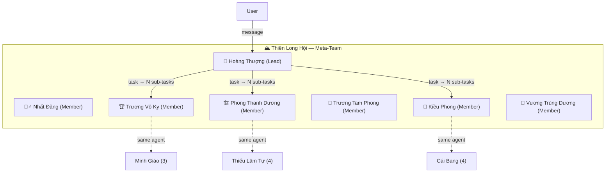

# Meta-Team Orchestrator — Design & Implementation Plan

## 1. Problem

GoClaw's team system is **intra-team only**: a lead orchestrates members within a single team. There is no mechanism for a "super-lead" to coordinate work **across multiple teams**, route user requests to the appropriate team, or aggregate results from different teams.

## 2. Solution: Meta-Team Pattern

A **master orchestrator agent** (Hoàng Thượng 👑) sits atop all teams as the lead of a special meta-team (**Thiên Long Hội**). Each existing team's lead is added as a **member**. The master routes incoming user requests to the right team lead(s) via the shared task board.

### Why This Works (Key Architecture Facts)

| Concern | Resolution |
|---------|------------|
| **TEAM.md priority** | `GetTeamForAgent` uses `ORDER BY (lead_agent_id = $1) DESC` — teams where the agent is **lead** are always prioritized. Team leads see their own team's TEAM.md, never the meta-team's. |
| **Single-leadership constraint** | Each agent can lead only ONE team. Team leads join meta-team as **members**, not leads. No conflict. |
| **Agents in multiple teams** | Fully supported. Tool context uses `WithToolTeamID` for correct resolution. |
| **Cross-team task isolation** | Tasks are scoped per-team. Meta-team tasks and sub-team tasks live on separate boards. |
| **Lead dispatch block** | `dispatchTaskToAgent` blocks dispatch to lead agents (prevents dual-session loop). Cascading creates NEW tasks in the lead's team instead of dispatching directly. |

### Architecture Diagram



---

## 3. Implementation

### Phase 1: Seeding Script ✅ COMPLETED

**File:** `scripts/seed-meta-team.js`

- Created Hoàng Thượng agent (`ho-ng-th-ng`)
- Auto-discovered all 6 team leads
- Created Thiên Long Hội meta-team (ID: `019d2568-4457-7694-872b-7645845f71fb`)
- Injected IDENTITY.md persona

**Status:** Seeded and deployed. Commits `1ad4884f`, `83a31fb5`, `b8c96acc`.

---

### Phase 2: Auto-Add on Team Creation

**Goal:** When a new team is created, automatically add its lead to Thiên Long Hội.

**Mechanism:** Subscribe to `protocol.EventTeamCreated` bus event.

#### `cmd/gateway.go`

```go
msgBus.Subscribe("meta-team.auto-add", func(evt bus.Event) {
    payload, ok := evt.Payload.(protocol.TeamCreatedPayload)
    if !ok { return }

    metaTeam := findMetaTeam(ctx, teamStore)
    if metaTeam == nil { return }

    // Don't self-reference
    if payload.TeamID == metaTeam.ID.String() { return }

    leadAgent, err := agentStore.GetByKey(ctx, payload.LeadAgentKey)
    if err != nil { return }

    _ = teamStore.AddMember(ctx, metaTeam.ID, leadAgent.ID, "member")
    slog.Info("meta-team.auto-add: added lead", "key", payload.LeadAgentKey)
})
```

---

### Phase 3: Task Cascading (Multi-Team Fan-Out)

**Key insight:** A single meta-task can fan out to **N sub-tasks across M teams**. The meta-task only completes when **ALL sub-tasks from ALL teams** are done.

#### Data Model: `meta_task_links`

```sql
CREATE TABLE meta_task_links (
    id           UUID PRIMARY KEY DEFAULT gen_random_uuid(),
    meta_task_id UUID NOT NULL REFERENCES team_tasks(id) ON DELETE CASCADE,
    sub_task_id  UUID NOT NULL REFERENCES team_tasks(id) ON DELETE CASCADE,
    sub_team_id  UUID NOT NULL,
    status       TEXT NOT NULL DEFAULT 'pending',
    created_at   TIMESTAMPTZ NOT NULL DEFAULT now(),
    UNIQUE(meta_task_id, sub_task_id)
);
CREATE INDEX idx_meta_task_links_meta ON meta_task_links(meta_task_id);
CREATE INDEX idx_meta_task_links_sub  ON meta_task_links(sub_task_id);
```

#### Cascade Flow

```
Meta-Task: "Build and launch landing page"   (Thiên Long Hội)
  │
  ├─ Sub-task 1: "Implement UI" → Thiếu Lâm Tự
  │     └─ lead delegates to members
  │     └─ ✅ Completed → link status = completed
  │
  ├─ Sub-task 2: "QA & deploy" → Võ Đang
  │     └─ ✅ Completed → link status = completed
  │
  └─ Sub-task 3: "GTM campaign" → Cái Bang
        └─ ✅ Completed → ALL links done → META-TASK AUTO-COMPLETES ✅
```

#### Bus Subscribers

**Subscriber A: Cascade on assignment** (`protocol.EventTeamTaskAssigned`)
1. Is task in meta-team? → continue
2. Resolve assigned agent → find their team via `GetTeamForAgent`
3. Create sub-task in that team (unassigned, pending — lead picks up naturally)
4. Insert `meta_task_links` row

**Subscriber B: Aggregate completion** (`protocol.EventTeamTaskCompleted`)
1. Lookup `meta_task_links` by `sub_task_id`
2. Update link status to `completed`
3. Check `AreAllSubTasksComplete(meta_task_id)` → if yes:
   - Aggregate results from all sub-tasks
   - Auto-complete meta-task with combined result
   - Broadcast completion event

**Subscriber C: Propagate failure** (`protocol.EventTeamTaskFailed`)
1. Update link status to `failed`
2. Optionally fail whole meta-task or mark link only

#### Files to Change

| File | Change |
|------|--------|
| `internal/store/pg/meta_task_links.go` | **[NEW]** Store methods for link CRUD |
| `cmd/gateway.go` | **[MODIFY]** Add 3 bus subscribers |
| DB migration | **[NEW]** `meta_task_links` table |

---

## 4. Verification Plan

| Step | Action | Expected |
|------|--------|----------|
| 1 | Run `seed-meta-team.js` | ✅ Already done |
| 2 | Create new team via dashboard | Lead auto-added to Thiên Long Hội |
| 3 | Meta-task assigned to 2+ leads | Sub-tasks appear in each team |
| 4 | Complete all sub-tasks | Meta-task auto-completes with aggregated result |
| 5 | Complete only some sub-tasks | Meta-task stays in-progress |
| 6 | Fail one sub-task | Meta-task reflects failure |

---

## 5. File Reference

| File | Change |
|------|--------|
| `scripts/seed-meta-team.js` | ✅ **[DONE]** Seeding script |
| `docs/meta-team-orchestrator-plan.md` | ✅ **[DONE]** This document |
| `docs/meta-team-personas.md` | ✅ **[DONE]** Persona spec |
| `cmd/gateway.go` | **[TODO]** Auto-add + cascade subscribers |
| `internal/store/pg/meta_task_links.go` | **[TODO]** Link store |
| DB migration | **[TODO]** `meta_task_links` table |
