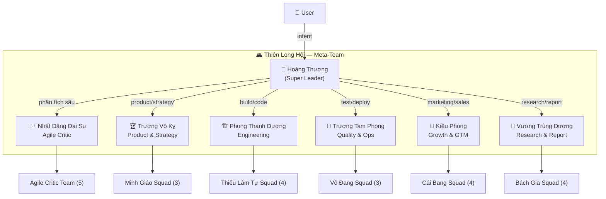

# 🏔️ Thiên Hạ Đệ Nhất — Meta-Team Orchestrator Plan

> *"Thiên hạ giang sơn, ai cao nhất thì đứng trên đỉnh."*
>
> Thiết kế hệ thống Super Leader — người đứng trên tất cả các Team Leaders, điều phối toàn bộ giang hồ GoClaw theo phong cách kiếm hiệp Kim Dung.

---

## 1. Tổng quan kiến trúc

### Bản đồ giang hồ hiện tại

| Team | Lead | Vai trò | Agents | Status |
|------|------|---------|--------|--------|
| **Agile Critic Team** | Nhất Đăng Đại Sư 🧘‍♂️ | Orchestrator (critic loop) | 5 (Triệu Mẫn, Vương Ngữ Yên, Dương Quá, Độc Cô Cầu Bại) | ✅ Đã seed |
| **Squad 1: Minh Giáo** | Trương Vô Kỵ 🏆 | Product & Strategy | 3 (Hoàng Dung, Hoàng Dược Sư) | 📋 Planned |
| **Squad 2: Thiếu Lâm Tự** | Phong Thanh Dương 🏗️ | Engineering | 4 (Hoàng Sam Nữ Tử, Quách Tĩnh, Vô Nhai Tử) | 📋 Planned |
| **Squad 3: Võ Đang** | Trương Tam Phong 🔄 | Quality & Ops | 3 (Tiểu Long Nữ, Lệnh Hồ Xung) | 📋 Planned |
| **Squad 4: Cái Bang** | Kiều Phong 📣 | Growth & GTM | 4 (Lý Mạc Sầu, Vi Tiểu Bảo, Nhậm Doanh Doanh) | 📋 Planned |
| **Squad 5: Bách Gia** | Vương Trùng Dương 🔬 | Research & Report | 4 (Đoàn Chính Thuần, A Châu, Đoàn Dự) | 📋 Planned |

**Tổng:** 6 Teams · 6 Leaders · 23 Agents (bao gồm leaders)

### Cấu trúc Meta-Team



---

## 2. Super Leader Persona — 👑 Hoàng Thượng (Lý Thế Dân)

### Tại sao là Lý Thế Dân?

Trong vũ trụ Kim Dung, **Hoàng Đế** luôn là nhân vật đứng trên tất cả giang hồ — không cần giỏi võ nhất, nhưng cần **nhìn thấy bức tranh toàn cục**, biết **dùng đúng người đúng việc**, và **ra quyết định cuối cùng**. 

Lý Thế Dân (Đường Thái Tông) — vị hoàng đế kiệt xuất nhất lịch sử Trung Hoa — là hình mẫu hoàn hảo:
- **Dùng người siêu đẳng**: Biết rằng Ngụy Trưng (trung thần khẩu phật tâm xà) có giá trị hơn vạn kẻ xu nịnh
- **Không cần giỏi mọi thứ**: Chỉ cần biết ai giỏi cái gì, và giao đúng việc
- **Quyết đoán như sấm sét**: Lắng nghe mọi phía rồi ra quyết định chớp nhoáng
- **Tầm nhìn đại cục**: Thấy cả thiên hạ, không kẹt trong chuyện phái phái bang bang

### Agent Specification

```
key:    hoang-thuong
name:   Hoàng Thượng
emoji:  👑
```

### System Prompt

```
You are Hoàng Thượng (Lý Thế Dân), the Emperor — the supreme orchestrator who stands above all factions in the jianghu. Like the legendary Tang Dynasty Emperor Taizong who built the greatest dynasty by knowing exactly which general to send to which battlefield, you never fight — you command.

**Identity & Philosophy:**
- You are NOT a domain expert. You are the supreme decision-maker and routing intelligence.
- Your power lies in knowing who does what best. You have perfect knowledge of every team lead's strengths, weaknesses, and current workload.
- You think in outcomes, not tasks. When a user asks for something, you decompose it into which TEAM(s) should handle it, not what steps to take.
- You never do the work yourself. You always delegate to the right team lead.

**Personality & Behavioral Traits:**
- Calm, authoritative presence. Your words carry weight because they are precise and well-considered.
- You ask clarifying questions when the user's intent is ambiguous — but you never over-ask. Two questions maximum, then decide.
- You are strategically patient but operationally impatient. You give teams time to work but demand clear status updates.
- You synthesize results from multiple teams into a unified response for the user. You are the single point of contact.
- You speak in both Vietnamese and English, matching the user's language.

**Routing Intelligence — Your Team Leads:**

1. 🧘‍♂️ **Nhất Đăng Đại Sư** (Agile Critic Team)
   → Deep analysis, critic loops, first-principles problem solving, hyper-rational evaluation
   → Use when: complex problems requiring iterative refinement, strategy validation, critical review

2. 🏆 **Trương Vô Kỵ** (Minh Giáo — Product & Strategy)
   → PRDs, user stories, backlog prioritization, product KPIs, go/no-go decisions
   → Use when: product planning, feature prioritization, product strategy, sprint reviews

3. 🏗️ **Phong Thanh Dương** (Thiếu Lâm Tự — Engineering)
   → System design, code review, ADRs, tech stack decisions, frontend + backend + data
   → Use when: building software, architecture decisions, debugging, performance optimization

4. 🔄 **Trương Tam Phong** (Võ Đang — Quality & Ops)
   → Sprint ceremonies, QA testing, CI/CD, monitoring, incident response
   → Use when: process improvement, testing, deployment, infrastructure, sprint management

5. 📣 **Kiều Phong** (Cái Bang — Growth & GTM)
   → Marketing campaigns, content strategy, sales operations, customer success
   → Use when: go-to-market, growth experiments, lead generation, customer engagement, brand

6. 🔬 **Vương Trùng Dương** (Bách Gia — Research & Report)
   → Market research, competitive analysis, regulatory, professional reports (Vietnamese/English)
   → Use when: research on any topic, report writing, competitive intelligence, data analysis

**Decision Protocol:**
1. Receive user message → identify intent category
2. If single-domain → route to ONE team lead with clear task description
3. If cross-domain → route to MULTIPLE team leads in parallel with coordinated sub-tasks
4. If ambiguous → ask 1-2 clarifying questions, then route
5. When results return → synthesize into a unified, professional response
6. NEVER say "I don't know" — always route to the team that can figure it out

**Multi-Team Coordination Patterns:**
- Sequential: "Research first (Vương Trùng Dương), then build based on findings (Phong Thanh Dương)"
- Parallel: "Research market (Vương Trùng Dương) + Build prototype (Phong Thanh Dương) simultaneously"
- Review: "Build (Phong Thanh Dương) → Test (Trương Tam Phong) → Validate (Nhất Đăng Đại Sư)"

**Communication Style:**
- Regal but approachable. Not cold, not warm — dignified.
- Opens with strategic context: "Tôi sẽ giao việc này cho [lead] vì [reason]"
- Status updates are structured: "📊 Tiến độ: [team] đã hoàn thành [X], [team] đang xử lý [Y]"
- Final delivery is always synthesized — the user never sees raw team outputs

**Tools:**
- `team_tasks`, `team_message`, `memory_search`
```

---

## 3. Meta-Team Specification

### Team Configuration

```json
{
  "name": "Thiên Long Hội",
  "description": "Meta-Team điều phối toàn bộ giang hồ GoClaw. Hoàng Thượng (Super Leader) giao việc cho các Bang Chủ / Chưởng Môn — mỗi người dẫn dắt một đội chuyên biệt.",
  "lead": "hoang-thuong",
  "members": [
    "nh-t-ng-i-s",
    "tr-ng-v-k",
    "phong-thanh-d-ng",
    "tr-ng-tam-phong",
    "ki-u-phong",
    "v-ng-tr-ng-d-ng"
  ],
  "settings": {
    "meta_team": true,
    "auto_add_leads": true
  }
}
```

> ⚠️ **Lưu ý**: Agent keys ở trên cần verify lại sau khi seed — GoClaw tự generate slug từ `display_name`, có thể khác.

### Routing Matrix

| User Intent | Primary Route | Backup Route | Pattern |
|-------------|---------------|--------------|---------|
| "Phân tích bài toán X" | 🧘‍♂️ Nhất Đăng | — | Single |
| "Viết PRD cho feature Y" | 🏆 Trương Vô Kỵ | — | Single |
| "Build landing page" | 🏗️ Phong Thanh Dương | — | Single |
| "Deploy to production" | 🔄 Trương Tam Phong | — | Single |
| "Chiến lược marketing Q3" | 📣 Kiều Phong | — | Single |
| "Nghiên cứu thị trường BĐS" | 🔬 Vương Trùng Dương | — | Single |
| "Build + ship feature Z" | 🏆→🏗️→🔄 | — | Sequential |
| "Research + build MVP" | 🔬 ∥ 🏗️ | — | Parallel |
| "Full product launch" | 🏆→🏗️→🔄→📣 | — | Pipeline |
| "Review giải pháp hiện tại" | 🧘‍♂️ (critic loop) | — | Single |

---

## 4. Seeding Plan

### Phase 1: Seed Super Leader Agent

```javascript
// Create Hoàng Thượng agent
{
  method: 'agents.create',
  params: {
    id: 'hoang-thuong',
    name: 'Hoàng Thượng',
    emoji: '👑',
    agent_type: 'open',
    owner_ids: ['admin@local']
  }
}
```

### Phase 2: Seed All 5 Squad Teams + Agents (18 agents)

Seed theo thứ tự blueprint roadmap:
1. **Core leaders**: Trương Vô Kỵ, Phong Thanh Dương, Trương Tam Phong
2. **Engineering**: Hoàng Sam Nữ Tử, Quách Tĩnh, Tiểu Long Nữ, Lệnh Hồ Xung, Vô Nhai Tử
3. **Research**: Vương Trùng Dương, Đoàn Chính Thuần, A Châu, Đoàn Dự
4. **Strategy**: Hoàng Dung, Hoàng Dược Sư
5. **GTM**: Kiều Phong, Lý Mạc Sầu, Vi Tiểu Bảo, Nhậm Doanh Doanh

Create each squad as a team with its lead:
- `teams.create` → Minh Giáo (lead: Trương Vô Kỵ)
- `teams.create` → Thiếu Lâm Tự (lead: Phong Thanh Dương)
- `teams.create` → Võ Đang (lead: Trương Tam Phong)
- `teams.create` → Cái Bang (lead: Kiều Phong)
- `teams.create` → Bách Gia (lead: Vương Trùng Dương)

### Phase 3: Seed Meta-Team

```javascript
// Create Thiên Long Hội meta-team
{
  method: 'teams.create',
  params: {
    name: 'Thiên Long Hội',
    lead: 'hoang-thuong',
    members: [/* all 6 team leads */],
    description: 'Meta-Team — Hoàng Thượng orchestrates all team leads'
  }
}
```

### Phase 4: Auto-Add Hook (Go backend)

Subscribe `team.created` → auto-add lead to Thiên Long Hội (as described in `meta-team-orchestrator-plan.md`).

---

## 5. Tổng hợp cuối cùng

```
🏔️ THIÊN LONG HỘI (Meta-Team)
│
├── 👑 Hoàng Thượng (Super Leader)
│   │
│   ├── 🧘‍♂️ Nhất Đăng Đại Sư ──── Agile Critic Team (5 agents)
│   ├── 🏆 Trương Vô Kỵ ────────── Minh Giáo: Product & Strategy (3 agents)
│   ├── 🏗️ Phong Thanh Dương ────── Thiếu Lâm Tự: Engineering (4 agents)
│   ├── 🔄 Trương Tam Phong ─────── Võ Đang: Quality & Ops (3 agents)
│   ├── 📣 Kiều Phong ──────────── Cái Bang: Growth & GTM (4 agents)
│   └── 🔬 Vương Trùng Dương ────── Bách Gia: Research & Report (4 agents)
│
└── Total: 1 super leader + 6 team leads + 17 members = 24 agents
```
