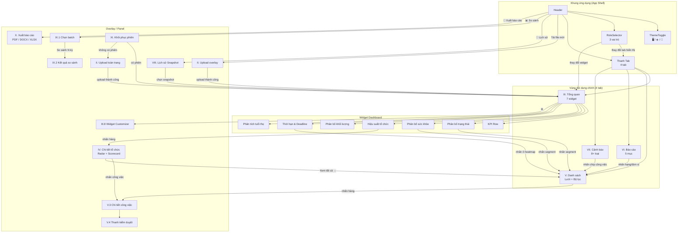
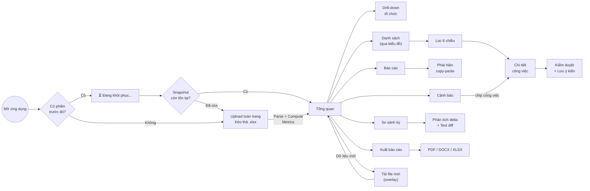
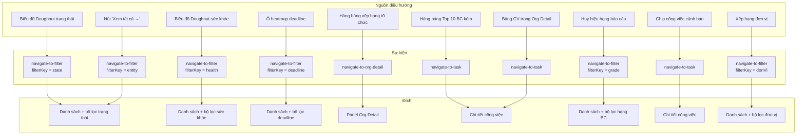

# Mô tả chi tiết hệ thống màn hình TaskLens v2

Tài liệu này mô tả toàn bộ các màn hình, overlay và thành phần giao diện mà hệ thống TaskLens v2 cần xây dựng. Mỗi mục trình bày mục đích, cấu trúc bố cục, các thành phần tương tác, luồng dữ liệu và hành vi của màn hình. Tài liệu áp dụng cho phiên bản Next.js + React + PostgreSQL (v2), bao gồm 15 chức năng P0 đã đặc tả qua 11 giai đoạn phát triển.

Cấu trúc hệ thống giao diện của TaskLens v2 tuân theo mô hình đơn trang (SPA) với một khung ứng dụng cố định gồm Header, thanh Tab và vùng nội dung chính. Tất cả màn hình được tổ chức dưới dạng tab hoặc overlay, không có chuyển trang truyền thống.

### Sơ đồ kiến trúc tổng thể các màn hình

Sơ đồ dưới đây thể hiện mối quan hệ chứa (containment) và kết nối điều hướng (navigation) giữa toàn bộ các màn hình trong hệ thống.

### Luồng người dùng từ lần đầu truy cập đến phân tích

Sơ đồ dưới đây mô tả hành trình sử dụng điển hình, từ khởi động ứng dụng qua các bước phân tích chính.

### Bản đồ điều hướng chéo giữa các màn hình

Sơ đồ dưới đây tập trung vào các sự kiện điều hướng chéo (cross-screen navigation event), cho thấy cách nhấn vào một phần tử trên màn hình này kích hoạt điều hướng sang màn hình khác kèm tham số bộ lọc.

---

## I. Khung ứng dụng chung

### 1.1 Header

Header là thanh tiêu đề cố định phía trên cùng, hiển thị xuyên suốt mọi trạng thái của ứng dụng. Thanh này chia thành ba vùng chức năng.

Vùng bên trái hiển thị tên ứng dụng (TaskLens) và bộ chọn vai trò (RoleSelector) dưới dạng dropdown cho phép người dùng chuyển đổi giữa ba chế độ xem. Vùng giữa hiển thị thông tin file đã tải (tên file, số lượng công việc, thời điểm tải). Vùng bên phải chứa cụm nút hành động gồm nút chuyển đổi giao diện sáng/tối (ThemeToggle), nút tải file mới, nút xem lịch sử snapshot, nút so sánh giữa các kỳ và nút xuất báo cáo.

Các nút hành động chỉ hiển thị khi đã có dữ liệu. Trong lần truy cập đầu tiên (chưa upload), Header chỉ hiển thị tên ứng dụng và ThemeToggle.

### 1.2 ThemeToggle

Nút chuyển đổi giao diện hoạt động theo cơ chế xoay vòng ba trạng thái. Nhấn lần đầu chuyển từ "hệ thống" sang "sáng", nhấn tiếp chuyển sang "tối", nhấn lần nữa quay lại "hệ thống". Mỗi trạng thái hiển thị biểu tượng tương ứng (🖥️ / ☀️ / 🌙). Hệ thống sử dụng CSS Custom Properties với hơn 130 biến tùy chỉnh để hỗ trợ cả hai chế độ giao diện. Chuyển đổi diễn ra mượt mà trong 0,25 giây thông qua CSS transition.

Cơ chế chống nhấp nháy (FOUC prevention) đảm bảo trang tải đúng giao diện ngay từ đầu. Một script đồng bộ chạy trong thẻ head đọc trạng thái giao diện từ localStorage trước khi trình duyệt vẽ bất kỳ phần tử nào. Trạng thái giao diện được lưu cả trong localStorage (cho lần tải tiếp) và cơ sở dữ liệu AppSession (cho phiên làm việc).

### 1.3 RoleSelector

Bộ chọn vai trò là một dropdown nằm trên Header cho phép chuyển giữa ba chế độ xem.

Vai trò "Nhà phân tích" (mặc định) hiển thị toàn bộ 4 tab, tất cả 7 widget trên Dashboard và không giới hạn bộ lọc. Vai trò "Quản lý đơn vị" hiển thị 3 tab (Tổng quan, Danh sách, Cảnh báo), tập trung vào các widget liên quan đến đơn vị (KPI, hiệu suất tổ chức, thời hạn, khối lượng). Vai trò "Lãnh đạo" chỉ hiển thị 2 tab (Tổng quan, Báo cáo) với bộ widget tinh gọn (KPI, phân bố trạng thái, sức khỏe tổng quan, hiệu suất tổ chức).

Khi chuyển vai trò, tab hiện tại mà vai trò mới không hỗ trợ sẽ tự động chuyển về tab Tổng quan. Bố cục widget được đặt lại về mặc định của vai trò mới. Vai trò được lưu vào AppSession trong cơ sở dữ liệu và phục hồi khi tải lại trang.

### 1.4 Thanh tab (TabNav)

Thanh điều hướng tab nằm ngay dưới Header, hiển thị sau khi có dữ liệu. Hệ thống có bốn tab chính với tiêu đề tiếng Việt. Tab "Tổng quan" hiển thị dashboard tổng hợp. Tab "Danh sách" hiển thị lưới dữ liệu chi tiết. Tab "Báo cáo" hiển thị phân tích chất lượng báo cáo. Tab "Cảnh báo" hiển thị các cảnh báo tự động kèm bộ đếm.

Thanh tab hỗ trợ điều hướng bằng bàn phím (mũi tên trái/phải) và phím tắt (Ctrl+1 đến Ctrl+4). Số lượng tab hiển thị thay đổi theo vai trò. Tab hoạt động được đánh dấu bằng viền dưới có hiệu ứng accent. Trạng thái tab được lưu vào phiên làm việc và phục hồi khi tải lại trang.

---

## II. Màn hình tải file (UploadZone)

Màn hình tải file có hai chế độ hiển thị, tương ứng hai tình huống sử dụng khác nhau.

### 2.1 Chế độ toàn trang (fullpage)

Chế độ toàn trang xuất hiện khi người dùng lần đầu truy cập hoặc chưa có dữ liệu nào trong hệ thống. Toàn bộ vùng nội dung chính hiển thị một khu vực kéo thả lớn với biểu tượng upload, dòng hướng dẫn "Kéo thả file Excel vào đây" và nút "Chọn file" cho phép duyệt file từ máy tính.

Khu vực kéo thả phản hồi trực quan khi file được kéo vào (viền đổi màu, nền sáng lên). Hệ thống chấp nhận file .xlsx và .xls, giới hạn dung lượng tối đa 50MB. Cho phép tải nhiều file cùng lúc, mỗi file hiển thị trạng thái riêng (đang xử lý, thành công, lỗi) trong danh sách trạng thái bên dưới vùng kéo thả.

Khi file được chọn, pipeline xử lý tự động kích hoạt theo thứ tự: nhận file, phân tích 32 cột bằng SheetJS, tính toán metrics sức khỏe và chất lượng báo cáo, tạo bản ghi Batch + Snapshot + Task + TaskVersion trong cơ sở dữ liệu, lưu trạng thái phiên và hiển thị dữ liệu trên giao diện.

### 2.2 Chế độ overlay

Chế độ overlay xuất hiện khi người dùng nhấn nút "Tải file mới" trên Header trong khi đã có dữ liệu. Thay vì thay thế toàn bộ trang, vùng upload hiển thị dưới dạng modal với nền mờ phía sau. Nội dung tab hiện tại vẫn nhìn thấy bên dưới lớp overlay. Có nút đóng (✕) ở góc phải trên và nhấn ra ngoài cũng đóng overlay.

Sau khi upload thành công, overlay tự động đóng và dữ liệu mới được hiển thị.

---

## III. Màn hình Tổng quan (Dashboard)

Dashboard là tab mặc định sau khi tải dữ liệu, trình bày góc nhìn tổng hợp toàn bộ tình trạng công việc. Màn hình bao gồm tối đa 7 widget có thể bật/tắt tùy chỉnh.

### 3.1 Dải KPI (widget kpi-row)

Dải KPI nằm trên cùng, hiển thị 6 thẻ chỉ số theo hàng ngang. Thẻ "Tổng CV" cho biết tổng số công việc. Thẻ "Hoàn thành" hiển thị tỉ lệ hoàn thành kèm thanh tiến trình. Thẻ "Quá hạn" hiển thị số công việc quá hạn bằng màu đỏ. Thẻ "Đình trệ" hiển thị số công việc đình trệ bằng màu cam. Thẻ "TB Sức khỏe" hiển thị điểm sức khỏe trung bình (0-100) kèm nhãn mức đánh giá. Thẻ "Chất lượng BC" hiển thị điểm chất lượng báo cáo trung bình kèm hạng chữ cái.

Mỗi thẻ có nền kính mờ (glassmorphism) với viền tinh tế, tạo cảm giác hiện đại.

### 3.2 Biểu đồ phân bố trạng thái (widget state-chart)

Biểu đồ Doughnut thể hiện phân bố 7 trạng thái công việc (Mới, Đang thực hiện, Chờ duyệt hoàn thành, Hoàn thành, Hủy bỏ, Tạm dừng, Chưa hoàn thành). Mỗi trạng thái có màu sắc riêng biệt, phần trung tâm hiển thị con số tổng. Nhấn vào từng phân đoạn trên biểu đồ sẽ điều hướng sang tab Danh sách với bộ lọc trạng thái tương ứng được áp dụng tự động.

### 3.3 Biểu đồ phân bố sức khỏe (widget health-chart)

Biểu đồ Doughnut tương tự nhưng thể hiện phân bố 5 mức sức khỏe: nghiêm trọng (0-20, đỏ), cảnh báo (21-40, cam), trung bình (41-60, vàng), tốt (61-80, xanh dương) và xuất sắc (81-100, xanh lá). Nhấn vào phân đoạn cũng điều hướng sang Danh sách với bộ lọc sức khỏe.

### 3.4 Hiệu suất tổ chức (widget org-ranking)

Mục này mặc định mở rộng, chứa bảng xếp hạng hiệu suất tổ chức. Phía trên bảng có bộ chuyển đổi ba chiều (Vùng / Lĩnh vực / Đơn vị) dạng nhóm nút, nhấn vào nút nào thì bảng hiển thị dữ liệu theo chiều đó.

Bảng xếp hạng gồm 9 cột có thể sắp xếp: thứ hạng (huy hiệu màu), tên thực thể, số công việc, hoàn thành trung bình (%), chất lượng báo cáo, sức khỏe, tỉ lệ quá hạn, tỉ lệ đình trệ, điểm tổng hợp. Cột cuối cùng có nút mở rộng (ℹ️) hiển thị công thức chi tiết tính điểm tổng hợp (0.30×HT + 0.25×CL + 0.20×ĐH + 0.15×SK + 0.10×NS).

Huy hiệu thứ hạng chia ba nhóm: 25% đầu (xanh lá), 50% giữa (trung tính), 25% cuối (đỏ). Thực thể có dưới 3 công việc hiển thị huy hiệu "⚠ < 3 CV" và không được xếp hạng. Khi trung bình tổng hợp toàn hệ thống dưới 40, bảng tự chuyển sang chế độ xếp hạng tương đối (phần trăm percentile) với nhãn "Xếp hạng tương đối" hiển thị rõ trên bảng.

Nhấn vào hàng bất kỳ trong bảng mở panel chi tiết tổ chức (drill-down).

Phần chân bảng hiển thị công thức tính điểm tổng hợp để minh bạch thuật toán.

### 3.5 Phân bố khối lượng (widget workload)

Mục này mặc định thu gọn, nhấn vào tiêu đề để mở rộng. Phía trên hiển thị dải thống kê gồm giá trị nhỏ nhất, lớn nhất, trung bình, trung vị và độ lệch chuẩn của số công việc mỗi thực thể.

Phía dưới là biểu đồ thanh ngang, mỗi thanh đại diện một thực thể, chiều rộng tỉ lệ với số công việc. Thực thể có số công việc vượt mean + 1.5 độ lệch chuẩn gắn cờ "Quá tải" (đỏ). Thực thể có số công việc dưới mean − 1 độ lệch chuẩn gắn cờ "Ít việc" (vàng).

### 3.6 Thời hạn và deadline (widget timeline)

Mục này mặc định mở rộng, chia hai phần chính.

Phần heatmap deadline là lưới lịch 4 tuần liên tiếp dạng 7 cột (thứ Hai đến Chủ nhật) nhân 4+ hàng (tuần). Mỗi ô được tô màu theo mật độ deadline: ô trống, ít, trung bình, nhiều hoặc tập trung cao. Nhấn vào ô điều hướng sang Danh sách lọc theo ngày deadline đó.

Phần phân nhóm quá hạn chia 4 mức nghiêm trọng: nhẹ (1-7 ngày, vàng), trung bình (8-14 ngày, cam), nghiêm trọng (15-30 ngày, đỏ) và rất nghiêm trọng (30+ ngày, đỏ đậm). Mỗi mức hiển thị số lượng công việc và danh sách thu gọn 3 công việc đầu tiên (có thể mở rộng).

Phần deadline sắp tới nhóm theo "Tuần này", "Tuần sau", "Tháng này", mỗi nhóm kèm số lượng và danh sách chip công việc có thể nhấn để điều hướng.

### 3.7 Phân tích tuổi thọ (widget aging)

Mục này mặc định thu gọn. Biểu đồ thanh ngang xếp chồng thể hiện phân bố 6 nhóm tuổi: mới (0-7 ngày, xanh lá), trẻ (8-14 ngày, xanh dương), trung bình (15-30 ngày, vàng), cũ (31-60 ngày, cam), rất cũ (61-90 ngày, đỏ) và quá cũ (90+ ngày, đỏ đậm).

Bên dưới hiển thị thống kê tuổi trung bình, tuổi trung vị và bảng nhỏ 5 công việc cũ nhất còn hoạt động với cột mã, tiêu đề, tuổi (ngày), sức khỏe và trạng thái.

### 3.8 Widget Customizer

Widget Customizer là panel trượt vào từ bên phải màn hình khi nhấn nút ⚙️ trên Dashboard. Panel rộng 320px với hiệu ứng kính mờ, liệt kê tất cả 7 widget dưới dạng danh sách hàng. Mỗi hàng gồm biểu tượng, tên widget và công tắc bật/tắt dạng iOS toggle.

Bật/tắt widget tác động ngay lập tức lên Dashboard phía sau panel (phản hồi thời gian thực). Có nút "Đặt lại mặc định" quay về cấu hình widget theo vai trò hiện tại. Trạng thái widget được lưu vào cơ sở dữ liệu (AppSession.widgetLayout dưới dạng JSON) với debounce 500ms để tránh gọi API quá nhiều lần.

---

## IV. Panel chi tiết tổ chức (Org Detail Drill-down)

Panel này xuất hiện khi nhấn vào hàng trong bảng xếp hạng tổ chức trên Dashboard. Đây là panel trượt vào từ bên phải (slide-in) phủ lên nội dung chính với lớp nền mờ phía sau, đóng bằng nút ✕, nhấn vào nền mờ hoặc phím Escape.

Panel gồm 7 vùng nội dung xếp dọc.

Vùng tiêu đề hiển thị tên thực thể, huy hiệu chiều phân tích (Vùng/Lĩnh vực/Đơn vị), huy hiệu thứ hạng và nút đóng. Vùng scorecard hiển thị 4 thẻ chỉ số: hoàn thành trung bình, chất lượng báo cáo trung bình, sức khỏe trung bình và tổng số công việc.

Vùng biểu đồ radar có 5 trục (Hoàn thành, Chất lượng báo cáo, Sức khỏe, Đúng hạn, Năng suất) với thang 0-100, vùng tô màu bán trong suốt và đường viền accent. Vùng phân tích công thức hiển thị thanh ngang cho mỗi thành phần với giá trị gốc × trọng số = giá trị có trọng số.

Vùng bảng công việc liệt kê 10 công việc có sức khỏe thấp nhất trong thực thể đó, gồm cột mã, tiêu đề, trạng thái, hoàn thành (%), huy hiệu sức khỏe và hạng báo cáo. Nhấn vào hàng đóng panel và điều hướng đến công việc trong tab Danh sách.

Vùng xếp hạng cán bộ lãnh đạo (chỉ hiện khi chiều phân tích là Đơn vị) liệt kê các CBLĐ trong đơn vị, sắp xếp theo số công việc, kèm hoàn thành trung bình và chất lượng báo cáo.

Nút "Xem tất cả →" ở cuối panel đóng panel và điều hướng sang tab Danh sách với bộ lọc theo thực thể.

---

## V. Màn hình Danh sách (TaskList)

Tab Danh sách là trung tâm phân tích chi tiết, cho phép duyệt, lọc, sắp xếp và kiểm duyệt từng công việc.

### 5.1 Thanh lọc (Filter Bar)

Thanh lọc nằm trên cùng tab, chứa 6 dropdown lọc đa chọn: trạng thái, đơn vị, vùng, người phụ trách, mức sức khỏe và đánh giá báo cáo. Mỗi dropdown cho phép chọn nhiều giá trị cùng lúc, có nút "Chọn tất cả" và "Bỏ chọn" trong mỗi dropdown.

Bên cạnh dropdown có ô tìm kiếm với debounce (tìm theo mã, tiêu đề, đơn vị, người phụ trách) và dropdown sắp xếp với 6 tùy chọn (sức khỏe tăng/giảm, hoàn thành tăng/giảm, chất lượng giảm, deadline tăng).

Bên dưới thanh lọc hiển thị các chip bộ lọc đang hoạt động, mỗi chip có nút ✕ để xóa riêng bộ lọc đó. Thanh lọc phản hồi tức thì, lưới dữ liệu bên dưới cập nhật ngay khi thay đổi bất kỳ tiêu chí nào.

### 5.2 Lưới dữ liệu (Task Grid)

Lưới hiển thị danh sách công việc dưới dạng bảng nhiều cột. Mỗi hàng chứa: thanh sức khỏe dọc (dải màu), cột thông tin (huy hiệu trạng thái, mã, tiêu đề, người phụ trách, đơn vị), mô tả rút gọn, huy hiệu báo cáo (A-F), vùng, thanh tiến trình (%), huy hiệu sức khỏe (0-100) và cột cờ.

Cột cờ chứa các chỉ báo trực quan: 🔴 quá hạn (kèm số ngày), 🟡 deadline gấp (≤3 ngày), ⏰ sắp deadline (≤7 ngày), ✏️ đã có nhận xét kiểm duyệt (kèm huy hiệu nhỏ hiển thị trạng thái đề xuất nếu khác trạng thái hiện tại).

Lưới phân trang mỗi 50 công việc, thanh phân trang ở cuối gồm số trang, nút trước/sau. Hỗ trợ điều hướng bàn phím: mũi tên lên/xuống giữa các hàng, Enter để mở panel chi tiết.

### 5.3 Panel chi tiết công việc (Detail Panel)

Nhấn vào hàng trong lưới mở panel chi tiết dạng overlay trượt vào từ bên phải. Panel sử dụng bố cục hai cột: cột trái là thanh kiểm duyệt (Annotation Sidebar, 280px, cố định theo cuộn), cột phải là nội dung chi tiết có thể cuộn.

Phần nội dung chi tiết chia thành 4 mục con.

Mục "Banner rủi ro" nằm trên cùng, hiển thị ngay lập tức các vấn đề phát hiện để người rà soát nắm bắt nhanh. Các mục rủi ro được phân theo 3 mức nghiêm trọng (critical/warning/info) với biểu tượng và màu tương ứng, bao gồm: quá hạn, đình trệ, báo cáo kém, tiến độ so với thời gian, độ trễ cập nhật. Nếu phát hiện từ khóa lo ngại (22 từ tiếng Việt như "chậm", "chưa", "vướng", "trễ"), danh sách từ khóa được liệt kê kèm ngữ cảnh xuất hiện.

Mục "Tổng quan" (📋) hiển thị dạng lưới 3 cột chứa tất cả trường thông tin cơ bản: trạng thái (huy hiệu), tỉ lệ hoàn thành, đơn vị thực hiện, đơn vị liên quan, vùng, lĩnh vực, mảng, người phụ trách, CBQL, CBLĐ, mức ưu tiên, mô tả nội dung và mục tiêu cần đạt.

Mục "Tiến độ" (📈) hiển thị thanh so sánh trực quan giữa tiến độ thực tế và thời gian đã trôi qua, kèm các trường ngày (ngày giao, ngày bắt đầu, hạn kết thúc) với thời gian tương đối (cách đây X ngày).

Mục "Báo cáo" (📝) hiển thị 4 trường báo cáo (kết quả kỳ này, kế hoạch kỳ tới, vướng mắc, đề xuất), mỗi trường kèm điểm chất lượng riêng. Từ khóa lo ngại được tô nổi trong văn bản, số liệu được highlight riêng biệt.

Mục "Phê duyệt" (✅) hiển thị trường thẩm định và cảnh báo từ Excel gốc, kèm bảng giải thích lý do điểm sức khỏe.

Panel đóng bằng nút ✕, phím Escape hoặc nhấn vào nền mờ phía sau.

### 5.4 Annotation Sidebar (thanh kiểm duyệt)

Thanh kiểm duyệt cố định bên trái panel chi tiết, cao toàn màn hình, giữ nguyên vị trí khi cuộn nội dung bên phải. Tiêu đề "✏️ Ý kiến kiểm duyệt" kèm nút thu gọn (◀/▶).

Thành phần chính gồm textarea nhiều dòng để nhập nhận xét, dropdown chọn trạng thái đề xuất (lấy từ 7 trạng thái hệ thống: Mới, Đang thực hiện, Chờ duyệt hoàn thành, Hoàn thành, Hủy bỏ, Tạm dừng, Chưa hoàn thành) và nút "💾 Lưu ý kiến".

Nếu công việc đã có nhận xét trước đó, textarea và dropdown được điền sẵn. Sau khi lưu, nút chớp "✓ Đã lưu!" và sidebar thu gọn. Nhận xét được lưu vào cơ sở dữ liệu liên kết với Task (không phải TaskVersion), do đó tồn tại qua các lần upload mới.

Trên lưới, công việc có nhận xét hiển thị biểu tượng ✏️ trong cột cờ.

Trên màn hình hẹp hơn 900px, sidebar chuyển từ bố cục cạnh nhau sang xếp chồng lên trên.

---

## VI. Màn hình Báo cáo (Reports)

Tab Báo cáo tập trung toàn bộ phân tích liên quan đến chất lượng báo cáo của các công việc. Gồm 5 mục xếp dọc.

### 6.1 Tổng quan chất lượng báo cáo

Biểu đồ Doughnut phân bố 5 hạng chất lượng (A đến F) với bảng chú thích bên cạnh hiển thị số lượng công việc mỗi hạng. Bên dưới biểu đồ là hàng thẻ huy hiệu hạng, mỗi thẻ có màu riêng (A xanh lá, B xanh dương, C vàng, D cam, F đỏ) kèm số lượng. Nhấn vào hạng nào lọc theo hạng đó.

### 6.2 Giải thích cơ chế chấm điểm

Mục "Vì sao điểm thấp?" trình bày cơ chế tính điểm chất lượng báo cáo. Hiển thị thanh ngang điểm trung bình cho mỗi trường báo cáo (kết quả kỳ này, kế hoạch kỳ tới, vướng mắc, đề xuất). Trường có điểm thấp nhất được nhận diện và gắn nhãn.

Phía dưới là bảng giải thích chi tiết: độ dài văn bản → điểm chất lượng → đóng góp có trọng số → hạng tổng hợp. Hệ thống cộng 5 điểm cho báo cáo cập nhật đúng kỳ và trừ 10 điểm cho báo cáo quá 3 tuần không cập nhật.

### 6.3 Top 10 báo cáo chất lượng thấp nhất

Bảng liệt kê 10 công việc có điểm báo cáo thấp nhất, gồm cột mã, tiêu đề (rút gọn 40 ký tự), đơn vị, huy hiệu hạng và điểm số. Mỗi hàng có thể nhấn để điều hướng sang chi tiết công việc trên tab Danh sách.

### 6.4 Phát hiện sao chép (copy-paste) 3 lớp

Mục này là tính năng đặc trưng của hệ thống, chia thành ba lớp phân tích.

Lớp 1 (sao chép nội tại) phát hiện cùng một công việc có nội dung trùng lặp giữa các trường khác nhau (ví dụ kết quả kỳ này giống kế hoạch kỳ tới). Sử dụng thuật toán trigram similarity, hiển thị tỉ lệ tương đồng (%) và các trường bị phát hiện. Mỗi công việc tương ứng một chip có thể nhấn để điều hướng.

Lớp 2 (sao chép chéo) phát hiện hai công việc khác nhau có văn bản báo cáo tương đồng trên 70%. Hiển thị cặp công việc so sánh kèm tỉ lệ tương đồng, cả hai công việc đều có đường dẫn drill-down.

Lớp 3 (sao chép lịch sử) phát hiện cùng một công việc nhưng qua các kỳ báo cáo khác nhau (ví dụ T2/2026 so với T3/2026) có văn bản giống hệt nhau, nghĩa là báo cáo sao chép từ kỳ trước mà không cập nhật thông tin mới. Chỉ hiển thị khi có nhiều hơn một snapshot trong hệ thống.

### 6.5 Bảng xếp hạng đơn vị theo chất lượng báo cáo

Bảng liệt kê các đơn vị với điểm chất lượng báo cáo trung bình, sắp xếp từ thấp nhất lên, kèm số lượng công việc. Nhấn vào đơn vị để lọc danh sách công việc theo đơn vị đó.

---

## VII. Màn hình Cảnh báo (Alerts)

Tab Cảnh báo tổng hợp tất cả vấn đề tự động phát hiện từ dữ liệu, giúp người rà soát nhanh chóng nhận diện các điểm cần can thiệp. Tiêu đề tab kèm bộ đếm số cảnh báo. Có thanh lọc theo mức nghiêm trọng (tất cả / nghiêm trọng / cảnh báo / thông tin).

### 7.1 Các loại cảnh báo

Hệ thống tạo 8 loại cảnh báo, chia 3 mức nghiêm trọng.

Mức nghiêm trọng (critical, viền trái đỏ): "Công việc quá hạn" kích hoạt khi deadline đã qua (phân 4 mức: nhẹ 1-7 ngày, trung bình 8-14, nghiêm trọng 15-30, rất nghiêm trọng 30+). "Tiến độ đình trệ" kích hoạt khi hệ thống phát hiện trạng thái isStalled (tiến độ thấp + thời gian trôi nhiều). "Báo cáo hạng F" kích hoạt khi điểm chất lượng báo cáo tổng hợp đạt hạng F.

Mức cảnh báo (warning, viền trái cam): "Tiến độ chậm so với kế hoạch" kích hoạt khi progressVsTime đánh giá behind. "Công việc không khởi động" kích hoạt khi trạng thái "Đang thực hiện" nhưng hoàn thành 0%. "Thiếu trường báo cáo" kích hoạt khi dưới 50% các trường báo cáo then chốt được điền. "Deadline dồn cụm" kích hoạt khi 5+ công việc đến hạn cùng một tuần. "Sắp đến hạn" kích hoạt theo hai nhóm: tuần này và tuần sau.

Mức thông tin (info, viền trái xanh dương): "Từ khóa lo ngại" kích hoạt khi công việc chứa từ 5 từ khóa lo ngại trở lên. "Tương đồng chéo cao" kích hoạt khi cặp công việc có tỉ lệ tương đồng văn bản trên 80%. "Sức khỏe thấp" hiển thị 10 công việc có điểm sức khỏe thấp nhất. "Công việc quá cũ" kích hoạt khi công việc chạy quá 90 ngày.

### 7.2 Cấu trúc thẻ cảnh báo

Mỗi thẻ cảnh báo có viền trái được tô màu theo mức nghiêm trọng. Tiêu phần gồm tiêu đề cảnh báo, mô tả ngắn gọn, huy hiệu đếm số công việc liên quan. Phần thân chứa danh sách chip công việc, mỗi chip có thể nhấn để điều hướng sang công việc trên tab Danh sách.

---

## VIII. Lịch sử snapshot (SnapshotHistory)

Overlay lịch sử snapshot mở khi nhấn nút "📂 Lịch sử" trên Header. Hiển thị dưới dạng panel phủ lên nội dung hiện tại.

Nội dung chính là bảng liệt kê các snapshot đã tải, mỗi hàng gồm: tên file Excel gốc, nhãn kỳ báo cáo (tự động phát hiện từ tên file theo mẫu T3/Q1/2026-03), số công việc, thời điểm tải lên. Snapshot đang hoạt động được highlight bằng viền accent.

Hành động trên mỗi hàng: nhấn để chuyển sang xem snapshot đó (tải dữ liệu từ cơ sở dữ liệu, cập nhật giao diện), nút xóa (với xác nhận). Có nút so sánh cho phép chọn nhiều batch để mở màn hình so sánh.

---

## IX. Hệ thống so sánh giữa các kỳ (Comparison)

So sánh giữa các kỳ là tính năng cốt lõi của v2, cho phép đặt dữ liệu từ hai hoặc nhiều lần upload cạnh nhau và phân tích biến động.

### 9.1 Chọn batch so sánh (BatchSelector)

Khi nhấn "📊 So sánh" trên Header, overlay BatchSelector hiển thị danh sách tất cả batch (mỗi lần upload có thể chứa nhiều file). Mỗi batch hiển thị dưới dạng thẻ với checkbox chọn, nhãn (hoặc "Kỳ [ngày]" nếu chưa đặt tên), thời điểm upload, huy hiệu số file và danh sách tên file thu gọn (có thể mở rộng).

Batch được sắp xếp theo thời gian tải lên, mới nhất ở trên. Cho phép chọn từ 2 batch trở lên. Batch đã chọn hiển thị số thứ tự (①②③) để chỉ thứ tự so sánh. Dòng hướng dẫn "Chọn ít nhất 2 kỳ để so sánh" hiện khi chưa chọn đủ.

Nút "So sánh N kỳ" ở cuối overlay, vô hiệu hóa khi chưa chọn đủ 2 batch, hiển thị spinner khi đang xử lý.

### 9.2 Kết quả so sánh (ComparisonView)

Sau khi nhấn so sánh, ComparisonView thay thế BatchSelector, hiển thị toàn màn hình dưới dạng overlay lớn với nút đóng.

Phần tóm tắt so sánh gồm hàng 5 thẻ: số công việc cải thiện (xanh lá), giảm sút (đỏ), không đổi (xám), mới xuất hiện (xanh dương) và bị loại bỏ (cam). Mỗi thẻ hiển thị số lượng và biểu tượng hướng.

Phần bảng delta chi tiết là bảng mở rộng liệt kê từng công việc có mặt ở cả hai batch. Mỗi hàng gồm mã công việc, tiêu đề, và các cột delta. Cột delta hiển thị DeltaBadge cho mỗi trường thay đổi: mũi tên lên (↑, xanh lá) cho cải thiện, mũi tên xuống (↓, đỏ) cho giảm sút, dấu bằng (=, xám) cho không đổi. Các trường số (hoàn thành, sức khỏe, chất lượng) hiển thị giá trị cũ → mới. Nhấn mở rộng hàng hiển thị chi tiết delta cho tất cả 32 trường.

Phần diff cấp từ cho các trường văn bản tiếng Việt (kết quả kỳ này, kế hoạch kỳ tới, vướng mắc, đề xuất). Khi người dùng mở rộng hàng và nhấn vào trường văn bản, hệ thống gọi API diff riêng (on-demand, không tính trước) và hiển thị kết quả diff cấp từ với từ bị xóa tô đỏ gạch ngang và từ mới thêm tô xanh lá nền sáng.

Phần biểu đồ xu hướng (AggregateTrendChart) là biểu đồ đường 3 trục hiển thị xu hướng qua các kỳ: sức khỏe trung bình, chất lượng báo cáo trung bình và tỉ lệ hoàn thành trung bình. Mỗi điểm trên đường tương ứng một batch.

Phần TrendSparkline là biểu đồ SVG inline nhỏ gọn hiển thị trực tiếp trên mỗi hàng công việc, thể hiện xu hướng điểm sức khỏe của công việc đó qua các kỳ.

Phần delta theo tổ chức (OrgDeltaCards) chia theo chiều tổ chức (vùng/lĩnh vực/đơn vị), mỗi thẻ hiển thị biến động điểm tổng hợp, số công việc cải thiện/giảm sút, với mã màu tương ứng.

---

## X. Xuất báo cáo điều hành (ExportModal)

Modal xuất báo cáo mở khi nhấn "📄 Xuất báo cáo" trên Header (hoặc Ctrl+E).

### 10.1 Giao diện chọn định dạng

Modal chia làm ba vùng. Vùng trên hiển thị 3 thẻ định dạng: PDF (biểu tượng 📄, mô tả "Báo cáo in ấn"), DOCX (biểu tượng 📝, mô tả "Bản Word chỉnh sửa") và XLSX (biểu tượng 📊, mô tả "Excel phân tích nâng cao"). Nhấn vào thẻ nào chọn định dạng đó.

Vùng giữa chứa hai tùy chọn mẫu báo cáo dạng radio: "Đầy đủ" (8 mục: tổng quan, rủi ro, hiệu suất tổ chức, quá hạn, chất lượng báo cáo, thời hạn, so sánh, metadata) và "Nhanh" (4 mục: tổng quan, rủi ro, hiệu suất tổ chức, quá hạn). Toggle "Bao gồm so sánh kỳ" cho phép bật/tắt mục so sánh (chỉ khả dụng khi đã thực hiện so sánh batch trước đó).

Vùng dưới hiển thị thẻ preview liệt kê các mục sẽ có trong báo cáo và nút tải về.

### 10.2 Nội dung từng định dạng

Báo cáo PDF sử dụng Puppeteer phía server để render HTML template hơn 300 dòng thành PDF khổ A4. Template sử dụng giao diện sáng (print theme) bất kể cài đặt giao diện người dùng, với biểu đồ thanh tạo bằng CSS thuần. Nội dung gồm dải KPI, bảng rủi ro hàng đầu, bảng xếp hạng tổ chức, phân tích quá hạn, chất lượng báo cáo, thời hạn và so sánh (nếu bật).

Báo cáo DOCX sử dụng thư viện docx để tạo file Word với tiêu đề mục, bảng có định dạng (3 hàng đầu tô xanh, 3 hàng cuối tô đỏ), header/footer có số trang.

Bản XLSX nâng cao gồm 2 sheet. Sheet đầu chứa 32 cột nguồn gốc từ Excel cộng 16 cột phân tích (sức khỏe, chất lượng, thời hạn, phân tích, so sánh) với định dạng có điều kiện, khung đóng băng (frozen panes) và bộ lọc tự động. Sheet thứ hai là bản tóm tắt chứa KPI, phân bố sức khỏe, xếp hạng tổ chức, phân bố hạng và phân nhóm quá hạn.

Sau khi tệp được tạo xong phía server, trình duyệt tự động tải về và modal đóng.

---

## XI. Trạng thái khôi phục phiên và loading

### 11.1 Màn hình khôi phục phiên

Khi người dùng tải lại trang hoặc mở lại trình duyệt, hệ thống kiểm tra phiên làm việc trước đó trong cơ sở dữ liệu (AppSession). Trong lúc đang tải, màn hình hiển thị trạng thái loading với biểu tượng ⏳, tiêu đề "Đang khôi phục..." và mô tả "Đang tải dữ liệu phiên làm việc trước".

Nếu tìm thấy phiên hợp lệ (snapshot chưa bị xóa), hệ thống tải lại toàn bộ dữ liệu từ cơ sở dữ liệu và phục hồi: snapshot đang xem, tab đang chọn, giao diện sáng/tối, vai trò và bố cục widget. Nếu snapshot đã bị xóa, hệ thống chuyển về trạng thái upload ban đầu.

### 11.2 Phím tắt

Hệ thống hỗ trợ phím tắt cho người dùng thành thạo: Ctrl+1 đến Ctrl+4 chuyển tab, Ctrl+Shift+T chuyển đổi giao diện, Ctrl+E mở xuất báo cáo, Ctrl+H mở lịch sử snapshot. Phím tắt không kích hoạt khi trỏ chuột đang trong ô nhập liệu (textarea, input).

---

## XII. Hệ thống thiết kế và trải nghiệm chung

### 12.1 Bảng màu và giao diện

Hệ thống thiết kế sử dụng hơn 130 CSS Custom Properties chia thành 8 nhóm: nền (3 lớp: base, surface, elevated), kính mờ (glass), văn bản (primary, secondary, muted), accent (xanh dương chủ đạo), ngữ nghĩa (success, warning, danger, info), sức khỏe (5 mức), hạng báo cáo (5 hạng A-F) và bóng.

Chế độ tối sử dụng nền đậm (#0d0f1a) với hiệu ứng kính mờ (glassmorphism) tạo cảm giác trong suốt phân lớp. Chế độ sáng sử dụng nền trắng ấm (#f8f9fc) với bóng nhẹ thay cho hiệu ứng phát sáng.

### 12.2 Phông chữ và kiểu chữ

Font chữ Inter được tải từ Google Fonts với 7 cấp độ kích thước (từ text-xs 0.75rem đến text-2xl 1.5rem). Hệ thống khoảng cách 8-unit (từ space-1 đến space-12).

### 12.3 Hệ thống huy hiệu

Hệ thống có hơn 20 biến thể huy hiệu phục vụ các ngữ cảnh khác nhau: huy hiệu trạng thái (7 màu theo 7 trạng thái), huy hiệu sức khỏe (5 màu theo 5 mức), huy hiệu hạng báo cáo (5 màu A-F), huy hiệu thứ hạng (3 nhóm), huy hiệu delta (cải thiện/giảm sút/không đổi) và huy hiệu cờ (quá hạn, deadline gấp).

### 12.4 Mục thu gọn được (CollapsibleSection)

Nhiều mục trên Dashboard và panel chi tiết sử dụng thành phần CollapsibleSection chung. Mỗi mục có tiêu đề kèm mũi tên chỉ trạng thái (▸ thu gọn, ▾ mở rộng). Nhấn vào tiêu đề để bật/tắt. Nội dung chỉ render khi mở rộng (lazy rendering) để tối ưu hiệu suất.

### 12.5 Biểu đồ

Hệ thống sử dụng Chart.js với 6 loại biểu đồ: Doughnut (phân bố trạng thái, sức khỏe, hạng báo cáo), Bar (xếp hạng, khối lượng), StackedBar (phân tích hoàn thiện từng trường), Radar (5 trục hiệu suất tổ chức), AggregateTrendChart (3 đường xu hướng cho so sánh) và TrendSparkline (SVG inline cho từng dòng so sánh).

Tất cả biểu đồ sử dụng theme tối với nền trong suốt, lưới mờ, tooltip tùy chỉnh và tự động chuyển sang theme sáng khi người dùng chuyển giao diện.

### 12.6 Xử lý lỗi

Mỗi tab được bọc trong ErrorBoundary riêng biệt, đảm bảo lỗi tại một tab không làm sập toàn bộ ứng dụng. Khi tab gặp lỗi, ErrorBoundary hiển thị thông báo thân thiện kèm nút tải lại tab.
